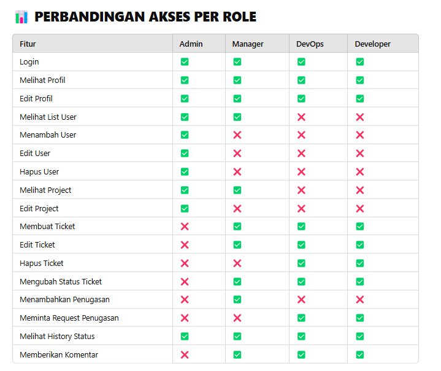

# Helpdesk 
## <a name="links">🔗 Assets</a>

- Figma Link [here](https://www.figma.com/design/rL1fkmMtbZAIhXeXkqrzo7/helpdesk-tugas-akhir?node-id=1-233&p=f&t=zSxplxTe9BDdIfta-0)
- Database Relations Link [here](./docs/RELATIONS.md)
- Database ERD Link [here](https://drive.google.com/file/d/17BkSPeHau8HbzyyKxQNaBooVvrSPq5vt/view?usp=drive_link)
- Plan process business [here](https://docs.google.com/document/d/12VTB6BW_HVXTWkGgP6lG2hb2ow1Sk5BGvF6ptn0XCNY/edit?tab=t.0)
- Document Tugas Akhir [here](https://drive.google.com/drive/folders/17vSX0WvQV-NcHQFd1lhS8fya4ZM66GbB)

## Feature Table

### Prerequisites

**Node version 18.7.x**

### Cloning the repository

```shell
git https://github.com/Yanuarprayoga9/helpdesk-fullstack.git
```

### Install packages

```shell
npm i
```

### Setup .env file 
```shell
cp .env.example .env 
```


```js
DATABASE_URL=
DIRECT_URL=


RESEND_API_KEY=

NEXT_PUBLIC_APP_URL=
```

### Setup Prisma
```shell

npx prisma generate
npx prisma migrate 
npx prisma db push
```

### Start the app

```shell
npm run dev
```

## Available commands

Running commands with npm `npm run [command]`

| command         | description                              |
| :-------------- | :--------------------------------------- |
| `dev`           | Starts a development instance of the app |
