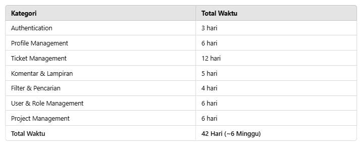

# 🚀 Project Ticket Management

## 📌 Fitur & Estimasi Waktu

### **1. AUTHENTICATION** (Total: **3 hari**)
- ✅ Login (Email & Password) 🟡 (3 hari)

### **2. PROFILE MANAGEMENT** (Total: **6 hari**)
- ✅ Melihat profil 🟢 (1 hari)
- ✅ Mengedit profil 🟡 (2 hari)
- ✅ Melihat daftar tiket yang ditugaskan 🟡 (2 hari)
- ✅ Melihat daftar tiket yang dibuat 🟢 (1 hari)

### **3. TICKET MANAGEMENT** (Total: **12 hari**)
- ✅ Membuat tiket 🔴 (3 hari)
- ✅ Mengedit tiket 🟡 (2 hari)
- ✅ Menghapus tiket 🟡 (2 hari)
- ✅ Melihat history perubahan status tiket 🟡 (2 hari)
- ✅ Mengubah status tiket (hanya pengguna dalam penugasan) 🟡 (2 hari)
- ✅ Menambahkan penugasan ke tiket 🟡 (2 hari)

### **4. KOMENTAR & LAMPIRAN** (Total: **5 hari**)
- ✅ Memberikan komentar pada tiket 🟡 (2 hari)
- ✅ Melihat komentar pada tiket 🟢 (1 hari)
- ✅ Melampirkan file pada tiket 🔴 (3 hari)

### **5. FILTER & PENCARIAN** (Total: **4 hari**)
- ✅ Filter dan pencarian tiket berdasarkan status & prioritas 🔴 (4 hari)

### **6. USER & ROLE MANAGEMENT** (Total: **6 hari**)
- ✅ Melihat daftar akun user 🟡 (2 hari)
- ✅ Menambahkan akun user 🟡 (2 hari)
- ✅ Mengedit akun user 🟡 (2 hari)
- ✅ Menghapus akun user 🟢 (1 hari)

### **7. PROJECT MANAGEMENT** (Total: **6 hari**)
- ✅ Melihat daftar proyek 🟡 (2 hari)
- ✅ Menambahkan proyek baru 🟡 (2 hari)
- ✅ Mengedit proyek 🟡 (2 hari)
- ✅ Menghapus proyek 🟢 (1 hari)

---

## 📊 Ringkasan Estimasi Waktu

---

## 📆 Timeline Pengerjaan dalam 4 Minggu

### **🔹 Minggu 1: Setup & Authentication**
- Next.js + NextAuth (Login)
- Prisma Setup (Database)
- Role-based authentication

### **🔹 Minggu 2: Core Features**
- CRUD Tickets
- User & Role Management
- Project Management

### **🔹 Minggu 3: Enhancements**
- Filter & Pencarian
- Komentar & Lampiran
- UI Improvements

### **🔹 Minggu 4: Testing & Deployment**
- Integrasi & Optimasi
- Testing (Jest, Playwright)
- Deployment ke Vercel

---

## 🛠 Tech Stack
- **Frontend**: Next.js, ShadCN, Tailwind CSS
- **Backend**: NextAuth, Prisma (PostgreSQL)
- **Deployment**: Vercel
- **Testing**: Jest, Playwright

**Catatan:** Estimasi waktu bisa berubah sesuai dengan kompleksitas fitur & debugging.

